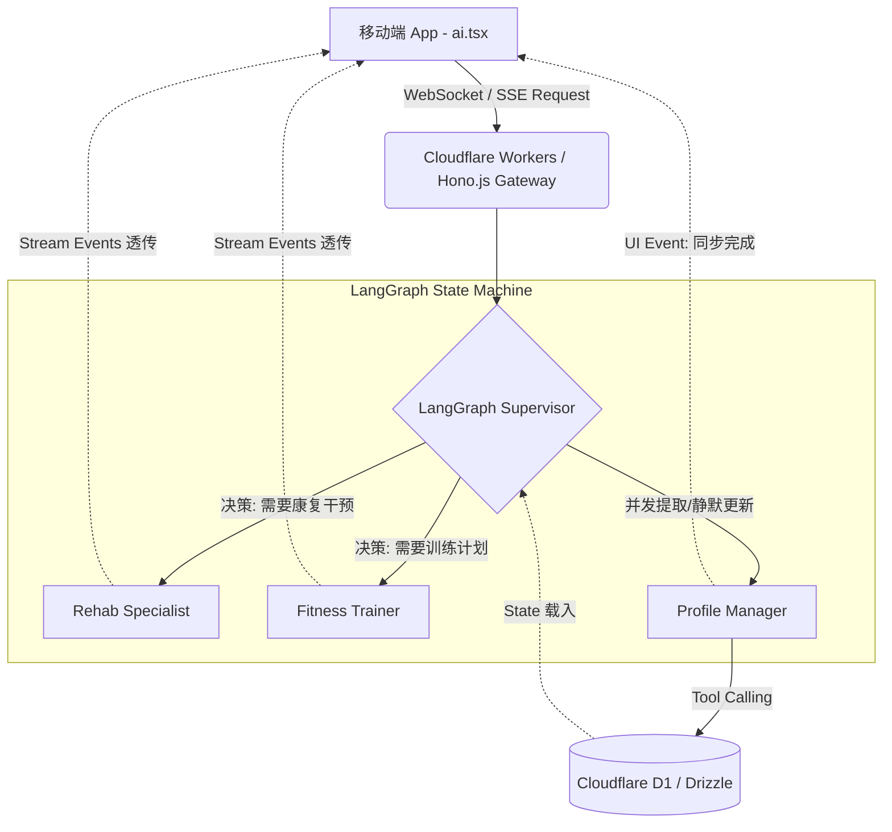

# LangGraph Supervisor Multi-Agent 重构计划 (移动端适配版)

## 0. 背景与核心愿景
当前《练了码》的移动端 AI 咨询系统已具备良好的交互体验，但随着业务复杂度增加，单体/简单路由的模型已无法满足长期运动档案管理、多角色协作（医生、康复师、营养师）的深度需求。
本计划旨在以后端 **LangGraph** 为核心骨架，构建一套**「图状态机核心 + 旁路记忆更新 + 前端流式透传」**的顶级工业级架构，将移动端彻底解放为纯粹的“渲染引擎”。

---

## 1. 系统架构全景图 (Architecture Overview)

---

## 2. 阶段一：后端 LangGraph 核心图谱构建 (Backend Graph Definition)
**目标**：在后端（强烈推荐 **TypeScript + Hono.js + Cloudflare Workers**）使用 `@langchain/langgraph` 定义明确的状态节点（Nodes）和边（Edges）。

### 2.1 推荐技术栈 (Tech Stack)
*   **后端语言**：TypeScript (无缝衔接现有系统与 Drizzle ORM 代码)
*   **Web 框架**：Hono.js (专为 Edge Runtime 打造，原生支持 Cloudflare Workers 和高性能 SSE 发送)
*   **Agent 编排**：`@langchain/langgraph` (与 Python 版核心概念 100% 对齐)
*   **可观测性**：LangSmith (必接，用于追踪多 Agent 调用链路与延迟)

### 2.2 定义全局状态 (Graph State)
定义每次会话通过图流转的共享状态字典。
*   `messages`：对话历史（包含 Tool Messages）。
*   `user_profile`：用户当前的结构化档案（身高、体重、伤病词典），在对话初始阶段从 DB 注入。
*   `next_representative`：当前指定的下一级处理 Agent，由 Supervisor 决定。

### 2.3 核心节点设计 (Core Nodes)
1.  **Supervisor Node (路由大脑)**
    *   **实现建议**：基于官方推荐的 "Agents as Tools" 或 Multi-Agent Supervisor 模式构建。
    *   **职责**：纯分类器，低延迟。阅读用户最后一条输入和 Profile，决定调用的下游节点。
    *   **输出**：`{ "next": "Rehab", "reason": "用户提及膝盖疼痛" }`。
2.  **Specialist Nodes (垂类专家如 Trainer, Rehab)**
    *   **职责**：携带严苛的 System Prompt 进行专业解答。
    *   **动作**：生成的结果**直接向前端抛出流片段 (Token stream)**，不需要 Supervisor 组装。
3.  **Profile Manager Node (记忆提取器 - 关键创新)**
    *   **架构亮点**：利用 LangGraph 原生的 parallel execution (并行节点) 发送机制，作为旁路节点运行，绝不阻塞主干对话的文字生成。
    *   **动作**：监听已完成的对话轮次，利用 Structured Output 和 Tool Calling 操作 Cloudflare D1 (复用现有 Drizzle ORM 配置)。
    *   **边界**：若发现致命伤病（如骨折）变更，可通过向 State 写入 `interrupt_signal` 触发前端弹窗强确认 (Human-in-the-Loop)。

---

## 3. 阶段二：前后端通信协议改造 (Protocol & Streaming)
**目标**：从单维度的纯文本流（Text Stream）跨越到多路复用的**事件流（Event-Driven SSE Server）**。

### 3.1 Edge Runtime SSE 流式输出
利用 `@langchain/langgraph` 的 `streamEvents({ version: 'v2' })` 捕获底层细节，通过 Hono.js 的 `streamSSE` 转化为 JSON Lines 格式吐出。完美兼容 Cloudflare Workers 的网络生命周期。

### 3.2 定义多维事件包 (Event Payloads)

*   **Type: `status`** (渲染前端顶部提示条，类似 Cursor)
    *   `{"type": "status", "agent": "Supervisor", "data": "正在评估您的关节情况..."}`
    *   `{"type": "status", "agent": "Rehab", "data": "正在调取运动康复医学文献..."}`
*   **Type: `primary_stream`** (渲染主聊天气泡)
    *   `{"type": "primary_stream", "data": "关于您的膝盖，我建议..."}`
*   **Type: `profile_sync`** (渲染档案写回成功的静默横幅)
    *   `{"type": "profile_sync", "data": { "part": "右膝", "status": "新增疼痛" }}`
*   **Type: `supplementary_card`** (渲染其他专家的补充意见面板)
    *   `{"type": "supplementary_card", "agent": "Nutritionist", "data": "建议补充鱼油以减缓炎症..."}`

---

## 4. 阶段三：移动端应用层适配 (Mobile Client Refactor)
**目标**：前端 (`app/(tabs)/ai.tsx` 及 `stores/chat.ts`) 大幅瘦身，化身为纯粹的状态机视图分发器。

### 4.1 瘦客户端改造 (Fat Backend, Thin Client)
*   **合并 UI**：移除分散的 Role 切换。全站业务统一收口至 `ai.tsx`，打造类似 Apple Intelligence 的统一唤起界面。
*   **引入标准 SSE 库**：放弃手写 Chunk reader，引入 `react-native-sse` 或 `EventSource` polyfill 处理服务端推送，获得自动重连与心跳保活能力。
*   **清理冗余逻辑**：删除前端复杂的失败重试、图片 Base64 降级代码，这类逻辑全部上移交给后端的 Cloudflare 网关处理。

### 4.2 动效与分发渲染 (UI/UX Dispatcher)
*   监听 SSE 的 `status` 事件流，配合 `react-native-reanimated` 渲染动态步骤呼吸灯。
*   监听到 `primary_stream`，驱动 Markdown 快速打字机渲染。
*   监听到 `profile_sync` 事件时，无需拉回全量数据，仅在顶部弹出 `writebackBanner` 气泡提示“已更新档案”，配合 `expo-haptics` 震动反馈。

---

## 5. 阶段四：渐进式落地路线图 (Implementation Roadmap)

### 里程碑 1：后端图引擎初始化 (Week 1)
1. 搭建基础的 TypeScript + Hono.js 脚手架，安装 `@langchain/langgraph`。
2. 接入 LangSmith，用于后续监控。
3. 构建 `Supervisor` 节点并硬编码打通 `Trainer` 节点，跑通最简单的分类和传递。
4. 在 Cloudflare Workers 环境下构建 Hono 的 SSE 接口，透传 `streamEvents` 数据流。

### 里程碑 2：前后端流式联调 (Week 2)
1. 彻底改造移动端，引入 `react-native-sse`，抛弃旧的 `api.streamChat`。
2. 移动端 UI 增加对于 `status` 步骤事件的动态视觉渲染（如打点器或横向滚动进度）。
3. 实盘测试单角色的透传流渲染以及首字节响应时间 (TTFB) 监控。

### 里程碑 3：攻坚 Profile Manager 与图状态 (Week 3)
1. 设计独立并行的 `Profile Manager` 节点。
2. 复用现有的 Drizzle ORM + D1 数据更新逻辑，在 TS 端封装为给 Profile Manager 调用的 Tools。
3. 注入长程持久化 Checkpointer（接入 `@langchain/langgraph-checkpoint` 的 KV 或 SQLite 实现），让对话断点恢复和演进周期在后端长期保存。

### 里程碑 4：多角色扩展与 UI 终态 (Week 4)
1. 接入 `Rehab`、`Nutritionist` 节点，跑通图内的角色交接与挂件式 (Widget) Supplementary Card 返回。
2. 前端根据 `supplementary_card` 类型渲染底部的折叠面板。
3. 对接医疗审计合规所需的日志记录，加入必要的确认弹窗 (Human-in-the-loop)。
4. 全面移除 `app/chat/[role].tsx` 以及过时的路由组件，完成最终代码清洗。

---
*Generated by Google Antigravity Architecture Agent*
