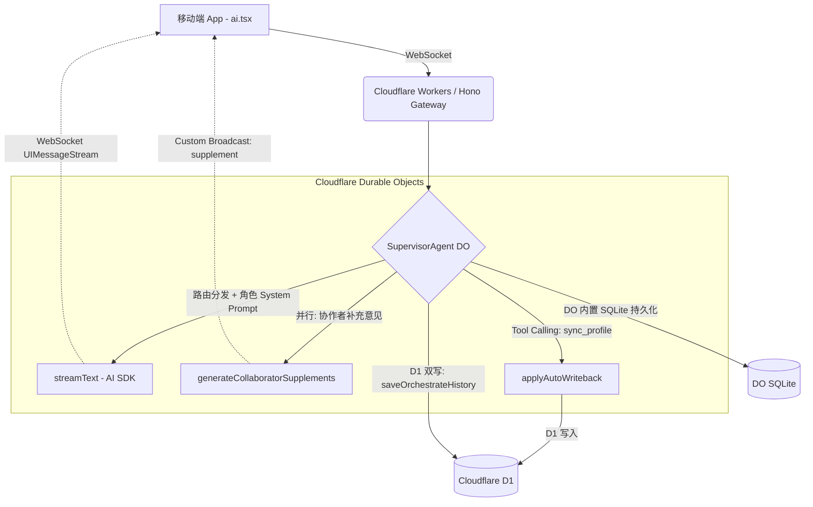

# Cloudflare Agents SDK Supervisor Multi-Agent 架构文档

> 最后更新：2026-02-25
> 原始文档由 AI 辅助生成，已根据实际实现校正。

## 0. 背景与核心愿景
当前《练了码》的移动端 AI 咨询系统已具备良好的交互体验，但随着业务复杂度增加，单体/简单路由的模型已无法满足长期运动档案管理、多角色协作（医生、康复师、营养师）的深度需求。
本架构以后端 **Cloudflare Agents SDK** 为核心骨架，构建一套**「Durable Objects 状态机核心 + D1 双写审计 + 前端流式透传」**的架构，将移动端彻底解放为纯粹的"渲染引擎"。

---

## 1. 系统架构全景图 (Architecture Overview)



### 关键设计决策
- **单 SupervisorAgent DO 内聚所有角色**：不再为每个专科角色创建独立 DO（Specialist Agent DO 已在 v2 迁移中删除），路由决策和角色切换在 SupervisorAgent 内完成
- **双轨持久化**：D1 用于审计/BI/REST 历史，DO SQLite 用于实时多设备同步
- **不使用 Drizzle ORM**：直接使用 D1 原生 SQL，不在当前迁移范围

---

## 2. 后端 Agents 核心设计 (Backend Agents Definition)

### 2.1 技术栈 (Tech Stack)
*   **后端语言**：TypeScript
*   **Web 框架**：Hono.js + `hono-agents` 中间件 (无状态入口，路由到对应 DO)
*   **Agent 编排**：`@cloudflare/ai-chat` (`AIChatAgent` 基类) + `agents` SDK
*   **AI 调用**：Vercel AI SDK (`ai` 包) — `streamText()`, `convertToModelMessages()`, `tool()`
*   **LLM 适配**：`@ai-sdk/openai-compatible` (连接 `https://api.izlx.de/v1`)
*   **状态持久化**：
    - Durable Objects 内置 SQLite（AIChatAgent 自动管理）
    - Cloudflare D1（审计/BI/REST 历史）

### 2.2 核心 Agent 设计 (Core Agents)

#### SupervisorAgent — 路由大脑 + 专科执行 ✅
*   **继承**：`AIChatAgent<Bindings>` (来自 `@cloudflare/ai-chat`)
*   **职责**：
    1. WebSocket JWT 认证 (`onConnect`)
    2. 意图路由：关键词 + LLM 双路由，决定 primaryRole + collaborators
    3. 构建角色专属 System Prompt + 用户上下文
    4. `streamText()` 流式生成主回答
    5. `generateCollaboratorSupplements()` 并行生成补充意见
    6. `sync_profile` Tool Calling + `needsApproval: true` (Human-in-the-loop)
    7. `saveOrchestrateHistory()` D1 双写

### 2.3 已删除的 Agent

以下 Specialist Agent DO 在 v2_remove_specialists 迁移中删除：
- ~~TrainerSpecialistAgent~~
- ~~RehabSpecialistAgent~~
- ~~NutritionistSpecialistAgent~~
- ~~DoctorSpecialistAgent~~
- ~~ProfileManagerAgent~~

**删除原因**：角色切换和写回在 SupervisorAgent 内聚处理，未接入主链路的独立 DO 已清理，降低运行与维护复杂度。

---

## 3. 前后端通信协议 (Protocol & Streaming)

### 3.1 WebSocket 连接

```
连接地址：wss://api-lite.izlx.de5.net/agents/supervisor-agent/{userId}?token={jwt}&sid={sessionId}
```

通过 `hono-agents` 中间件自动路由到对应的 Durable Object 实例。

### 3.2 事件协议 (Event Payloads)

#### AIChatAgent 内置协议

| 类型 | 方向 | 用途 |
|------|------|------|
| `cf_agent_use_chat_request` | 客户端→服务端 | 发送用户消息（UIMessage 格式） |
| `cf_agent_use_chat_response` | 服务端→客户端 | 流式回复（UIMessageStream 分块：text-delta, text-start, text-end, tool-approval-request, error, finish 等） |
| `cf_agent_chat_messages` | 服务端→客户端 | DO 持久化消息广播（重连恢复/多设备同步） |
| `cf_agent_chat_clear` | 客户端→服务端 | 清空 DO 持久化消息 |
| `cf_agent_tool_approval` | 客户端→服务端 | 用户审批工具调用 |

#### 自定义广播事件 (broadcastCustom)

*   **Type: `status`** — 渲染前端状态提示
    *   `{"type": "status", "message": "正在分析问题并分配专家..."}`
    *   `{"type": "status", "message": "正在呼叫【康复师】..."}`
*   **Type: `routing`** — 路由决策结果
    *   `{"type": "routing", "primary_role": "rehab", "primary_role_name": "康复师", "collaborators": [...], "reason": "..."}`
*   **Type: `supplement`** — 协作者补充意见
    *   `{"type": "supplement", "role": "nutritionist", "role_name": "营养师", "content": "建议补充鱼油以减缓炎症..."}`
*   **Type: `profile_sync_result`** — 档案同步结果
    *   `{"type": "profile_sync_result", "summary": { "profile_updated": true, "conditions_upserted": 1, ... }}`

---

## 4. 移动端应用层 (Mobile Client)

### 4.1 当前架构

*   **统一入口**：`app/(tabs)/ai.tsx` — 唯一的 AI 对话界面，纯 WebSocket，无 REST 历史加载
*   **WebSocket 管理**：`hooks/useAgentChat.ts` — 自定义 Hook，管理 WebSocket 连接、消息收发、流式渲染
*   **单次任务流**：`services/agent-stream.ts` — 首页训练计划、饮食分析、图片识别统一走 WS 单次请求
*   **无独立 chat store**：消息状态完全由 `useAgentChat` 内部 `useState` 管理，不经过 Zustand
*   **消息来源**：首屏消息完全来自 WS `cf_agent_chat_messages`（DO 重连广播），按 ID 去重合并
*   **4 个 Tab**：首页、AI 咨询、营养、我的

> **注意**：`api.ts` 中 SSE 流代码已下线，AI 统一通过 WS 协议收发。

### 4.2 UI 渲染分发

| 事件 | 渲染行为 |
|------|---------|
| `status` | 显示在流式气泡底部的状态文字 |
| `routing` | 助手消息上方的角色标签 (彩色圆点 + 角色名) |
| `cf_agent_use_chat_response` (text-delta) | Markdown 打字机效果渲染 |
| `supplement` | 助手消息下方的补充意见卡片（左边框 = 角色色） |
| `profile_sync_result` | 底部绿色横幅："已同步：身体档案、伤病记录 1 条" |
| `tool-approval-request` | 模态弹窗："确认同步数据？" + 确认/取消按钮 |

### 4.3 设计系统

```
品牌色：#FF6B35 (珊瑚橙)
角色色：
  - 运动医生：#DC2626 (红)
  - 康复师：#0EA5E9 (天空蓝)
  - 营养师：#16A34A (翡翠绿)
  - 私人教练：#FF6B35 (珊瑚橙)
```

---

## 5. 实施状态 (Implementation Status)

### 里程碑 1：最小化 Agent PoC ✅
1. ✅ 安装依赖：`agents@latest`, `@cloudflare/ai-chat@latest`, `hono-agents`
2. ✅ 配置 `wrangler.toml` Durable Objects 绑定
3. ✅ SupervisorAgent 继承 `AIChatAgent`，实现 `onChatMessage` + JWT `onConnect`
4. ✅ Hono 入口通过 `agentsMiddleware()` 路由到 Agent DO

### 里程碑 2：多角色协作 ✅
1. ✅ Supervisor 内部智能路由（关键词 + LLM 双路由）
2. ✅ 协作者补充意见并行生成
3. ✅ 自定义广播事件（routing, supplement, status, profile_sync_result）
4. ✅ 移动端 `useAgentChat` 接入 WebSocket 协议

### 里程碑 3：Tool Calling + Human-in-the-loop ✅
1. ✅ `sync_profile` 工具定义 + `needsApproval: true`
2. ✅ 前端 Tool Approval 弹窗
3. ✅ D1 写回 + 审计日志

### 里程碑 4：消息持久化统一 ✅
1. ✅ D1 双写保留（审计/BI 数据源，SupervisorAgent `onFinish` 中 `saveOrchestrateHistory`）
2. ✅ `cf_agent_chat_messages` 前端处理（`useAgentChat.ts` 已解析 + ID 去重合并）
3. ✅ `ai.tsx` 已切换为纯 WebSocket — 不再走 REST 历史加载，首屏消息来自 DO 重连广播
4. ✅ 首页训练计划 / 饮食分析 / 图片识别已迁移到 `streamSingleRoleAgent`，协议收敛为 WS 单协议

### 待完善

**其他**
- ❌ 自动化测试
- ❌ Drizzle ORM 迁移
